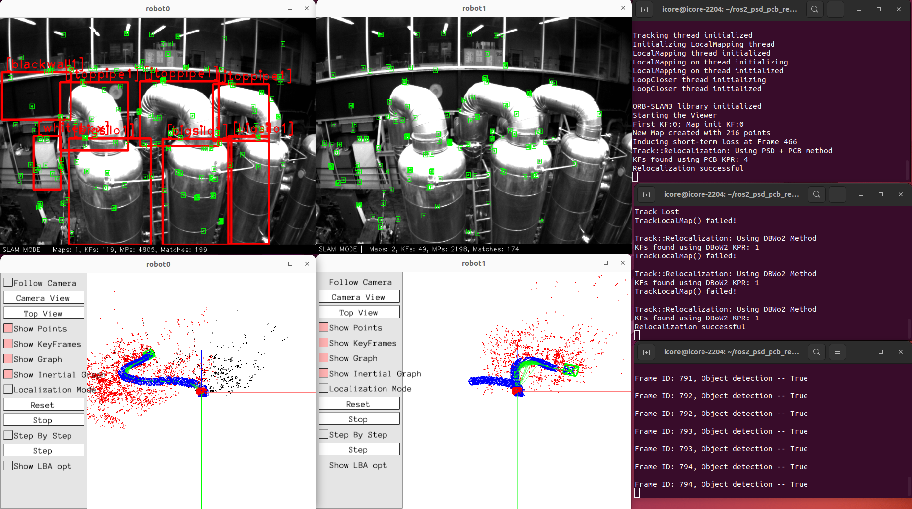

# Solving Short-Term Relocalization Problems In Monocular Keyframe Visual SLAM Using Spatial And Semantic Data

## Authors

1. Azmyin Md. Kamal
2. Neyni K. N. Dadson
3. Donovan Gegg
4. Dr. Corina Barbalata

All authors are with the Department of Mechanical Engineering at Louisiana State University, Baton Rouge, Louisiana, United States of America.

For brevity, we have divided this README into the following sections,

- Introduction
- Overview / Key Results / Bibliography
- Setup
- Demo and Side-by-Side Comparison
- Acknowledgement
- Closing remarks

---

## Introduction

This repository is a complete ***ROS 2 workspace*** which includes the proposed short-term relocalization method along with the presentation slides and the paper. Following ORB-SLAM3 and YOLOv5, this system will also uses [GPLv3](https://gist.github.com/kn9ts/cbe95340d29fc1aaeaa5dd5c059d2e60) License.

This work was presented in [2024 IEEE/ASME International Conference on Advanced Intelligent Mechatronics](https://www.aim2024.org/).

* [paper](https://ieeexplore.ieee.org/stamp/stamp.jsp?tp=&arnumber=10637187)

* [Slides](https://docs.google.com/presentation/d/1p_Ukic0ZfXyZjq8wjxNMZpKOc4GEQOv2/edit?usp=sharing&ouid=110812301970152705380&rtpof=true&sd=true) 

* A side-by-side comparison between the proposed and DBoW2 based short-term relocalization frameworks is shown below

https://github.com/user-attachments/assets/8972fc59-4c30-444c-813f-4f9af7ffd1bd

Thank you very much for your interest in our work. If you have any questions, comments and suggestions, please don't hesitate to opening an **Issue** in this repository. If you find this project useful, please consider citing the paper as shown below

```bibex
@inproceedings{kamal2024solving,
  title={Solving Short-Term Relocalization Problems In Monocular Keyframe Visual SLAM Using Spatial And Semantic Data},
  author={Kamal, Azmyin Md and Dadson, Nenyi Kweku Nkensen and Gegg, Donovan and Barbalata, Corina},
  booktitle={2024 IEEE International Conference on Advanced Intelligent Mechatronics (AIM)},
  pages={615--622},
  year={2024},
  organization={IEEE}
}
```

---

## Overview / Key Results / Bibliography

In this system, we introduced a novel multimodal keyframe descriptor dubbed **Pose-Semantic-Descriptor (PSD)**  and a new Keyframe-based Place Recognition (KPR) method called the **Pose-Class-Box (PCB)** . Using the novel KPR method, we deomstrate an accurate and computationally efficient solution to the **short-term relocalization** problem in comparison to the popular relocalization method based on [DBoW2](https://github.com/dorian3d/DBoW2) which comes standard in the [ORB-SLAM3](https://github.com/UZ-SLAMLab/ORB_SLAM3) framework. At this time, the proposed method has been only tested with the **PINHOLE** camera model. To fascilite testing of the proposed approach we have provided a number of image sequences and trained weights from the experiment in a Zenodo repository.

The contributions of this work are listed below

- A ***new keyframe descriptor*** called the Pose Semantic Descriptor (PSD) is proposed. It utilizes semantic data and camera pose to uniquely characterize keyframe objects in the pose graph. 

- A novel ***Keyframe Place Recognition (KPR)*** algorithm called the Pose-Class-Box (PCB) is formulated that significantly improves pose recovery performance from sudden tracking loss events

- The integration of the proposed descriptor and KPR method for iwithin the open-source ORB-SLAM3 VSLAM framework.

Important results from this work are shown below


The novel framework is implemented as a combination of **three** packages / modules 

- ```orb_slam3_ros2```: A MKVSLAM package based on [ROS2 ORB-SLAM3 V1.0](https://github.com/Mechazo11/ros2_orb_slam3) VSLAM system.

- ```py_ob_detector_yolov5``` A custom ROS 2 package that implements [YOLOv5 V5.0](https://github.com/ultralytics/yolov5), a PyTorch-based Object Detector. This package may be used in a **stand-alone** configuration with minor modifications. Please see the ```README.md``` file in  package for more details

- ```matimg_custom_msg_interface```, a package containing all custom messages required to transfer the semantic matrix between the MKVSLAM and Object Detector nodes.

All experiments were done in a laptop with the following configurations

- Ubuntu 22.04 Jammy Jellyfish
- Intel i5-9300H
- Nvidia RTX 2060
- 16 GB ram

In this implementation, the **python nodes** are the primary driver of the system as it processes image frames from chosen directory and supplies the **Semantic Matrix** to the C++ VSLAM nodes.

**Note!**, ORB-SLAM3 requires a lot of [memory](https://github.com/Mechazo11/ros2_orb_slam3/issues/7) during compilation. It is highly recommended to have at least 16Gb RAM with 8Gb swap during compilation.

---

## Setup

### Prerequisits

Please install and test the following software before building the workspace in this directory.

- ROS 2 Humble Hawksbill:  [tutorial](https://docs.ros.org/en/humble/index.html)

- Colcon: ```sudo apt install python3-colcon-common-extensions```

- Eigen3: ```sudo apt install libeigen3-dev```

- Numpy: ```pip3 install numpy```

- PyTorch with CUDA: [installation](https://docs.vultr.com/how-to-install-pytorch-on-ubuntu-22-04) and [test](https://stackoverflow.com/questions/48152674/how-do-i-check-if-pytorch-is-using-the-gpu)

- Natsort : ```pip3 install natsort```

- Requests: ```pip3 install requests```

### Configure .bashrc

The ```ros2_config.sh```, a shell script is used to automatically loads all the necessary configurations and source both the global and local ROS workspaces. Hence, set up this file using the following method

- Copy ```ros2_config.sh``` from ```\shell_script``` folder into ```\home```

- Add the following lines at the very end of the file of ```.bashrc```

```text
source ~/ros2_config.sh

if [[ ":$LD_LIBRARY_PATH:" != *":/usr/local/lib:"* ]]; then
    export LD_LIBRARY_PATH=/usr/local/lib:$LD_LIBRARY_PATH
fi
```

### Build the workspace

This workspace must be placed in ```\home``` directory as shown below

* Clone this repo in `\home` as shown below

```bash
cd ~
git clone https://github.com/RKinDLab/ros2_psd_pcb_reloc
```

* Source ROS 2 workspace and build the project

```bash
source /opt/ros/humble/setup.bash
colcon build --symlink-install
source ./install/setup.bash
```

* Add the `ros2_tictoc_profiler`, a package containing useful time statistics tools

```bash
cd ~/ros2_psd_pcb_reloc/src
git clone https://github.com/Mechazo11/ros2_tic_toc_profiler.git
cd ..
```

* Build all packages (must be from root of the workspace)

```bash
colcon build --symlink-install
source ./install/setup.bash
```

### Setup DATASETS/IEEEAIM2024_DATASETS directory

For demonstrating how to use this framework, we have packed all image sequencse from our in-house UGV dataset ```LSU_ICORE_MONO``` and all the neural network weights in this [LSU_AIM2024](https://zenodo.org/records/13137352) Zenodo repository. After downloading the files, do the following 

- Create the ```DATASETS``` directory in ```home``` directory as shown below

```console
cd ~
mkdir DATASETS
```

- Copy the ```IEEEAIM2024_DATASETS``` folders from ```LSU_AIM2024``` into ```/home/DATASETS``` directory. After copying, the ```DATASETS``` directory should look like the following 

For sequences from [EuRoC MAV](https://projects.asl.ethz.ch/datasets/doku.php?id=kmavvisualinertialdatasets) simply download the image sequences and put them in the ```/home/DATASETS/IEEEAIM2024_DATASETS``` directory. Refer to the image attached above.

However, for the sequences from [TUM RGBD SLAM](https://cvg.cit.tum.de/data/datasets/rgbd-dataset/download) dataset, these were modified to be **ETH-ASL** compliant for use with this experiment. We will update this repo in future with instructions on how to download and modify the SLAM sequences to be compatible with this system.

**NOTE!** during runtime, ground-truth data is not required.

---

### Download the weights for YOLOv5

- Copy the ```.pt``` files from ```LSU_AIM2024/Weights``` directory into ```ros2_psd_pcb_reloc/src/py_obj_detector_yolov5_ros2/weights_config``` directory.

---

## Side-by-Side Execution of Relocalization Systems
 
**NOTE!**, the C++ nodes must be started **first** before launching the python node since a ```handshake``` is performed between the C++ and Python node to pass all experiment and configuration parameters.

Open three terminals and execute the following

- Run ***robot0*** slam node:  ```ros2 run orb_slam3_ros2 vslam_node --ros-args -p agent_name:=robot0```

- Run ***robot1*** slam node:  ```ros2 run orb_slam3_ros2 vslam_node --ros-args -p agent_name:=robot1```

- Run python nodes : ```ros2 run py_obj_detector_yolov5_ros2 robot_combined_nn --ros-args -p experiment:="ieeeaim2024" -p image_sequence:="ROBOTICSLAB0"```

**NOTE!** The name string passed for ```image_sequence``` must match the name of the dataset given inside the ```DATASETS/IEEEAIM2024_DATASETS``` directory.

Panlogin and OpenCV terminals with name ```robot0``` represnts the VSLAM system with the **proposed relocalization** method whilst ```robot1``` is the ORB-SLAM3 DBoW2-based relocalization method that is shipped with ORB-SLAM3. You may need to move the windows around a bit. An example is shown below



---

## Using your own dataset

To use this novel short-term relocalization method with your custom dataset, the following assessts needs to be created

1. In ```ros2_psd_pcb_reloc/global_yamls/dataset_db.yaml```, create an entry for your enviornment i.e. ```MACHINE_HALL```, ```VICON_ROOM``` and update the necessary **keys** as shown in the file.

2. Also create another yaml file like those of ```EuRoC.yaml``` in ```ros2_psd_pcb_reloc/global_yamls``` directory that will supply the VSLAM node with the camera calibration matrix and ORB detector parameters.

3. For the YOLOv5 network, you need to train a network and copy the ```.pt``` weights into ```src/py_obj_detector_yolov5_ros2/weights_configs``` directory.

4. At the same time you may need to create a custom configuration file like the ```custom_euroc_mh.yaml``` inside ```src/py_obj_detector_yolov5_ros2/py_obj_detector_yolov5_ros2/neural_net/data``` directory
 
5. Finally, create an image sequence in the same tree structure shown in the **Setup** section.

---

## Acknowledgement

The authors would like to acknowledge financial support from NSF #2024795, and the Louisiana Board Of Regents Support Fund, under the Louisiana Materials Design Alliance (LAMDA), provided by the Board as cost share to the NSF under grant number OIA-#1946231.

---

## Closing remarks

Due to time constraint, we have not uploaded the steps and scripts required to perform the evaluation of the various parameters. If you are interesed in evaluating the proposed framework with your own data, please open an **Issue**.

---

## Misc.

* [DUAL-SLAM](https://github.com/HuajianUP/Dual_SLAM) A purely spatial data based relocalization method, published in IROS 2020. They also solved the same problem as this paper but did not name the problem as short-term relocalization

* [GDB with ros2](https://juraph.com/miscellaneous/ros2_and_gdb/)

* [Shell scripting](https://www.shellscript.sh/variables1.html)

## TODOs

- [ ] Release the training codes for YOLOv5 that we used for this experiment
- [x] Add link to arXiv version of the final paper
- [x] Build and test the packages [05/20/24]
- [x] Better introduction line shown in the top-left [07/02/24]
- [x] Update README.md file with clear step by step instruciton on setting up the system
- [x] Delete all package 2 related codes, ros2_tictoc_profiler, line_lbd, fast_mf
- [x] Start Zenodo and only publish LSU_iCORE_MONO dataset with instructions on how to download and setup the EuRoC and TUM FR2 dataset [1st week July 2024]
- [x] Upload all weights to Zendo and then download and test to make sure they work
- [x] For making a custom dataset work with the YOLOv5 in py_obj_detector, custom yaml files are needed. State how to add them into the /global_yaml files . This information needs to be placed ion the ```ros2_psd_pcb``` repository
