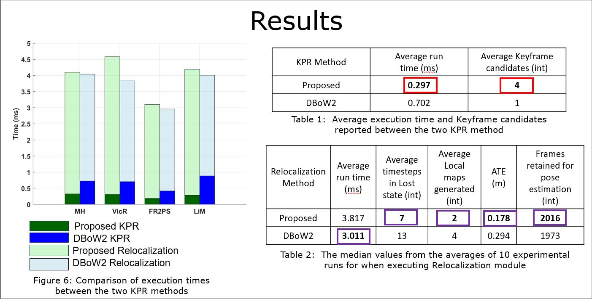
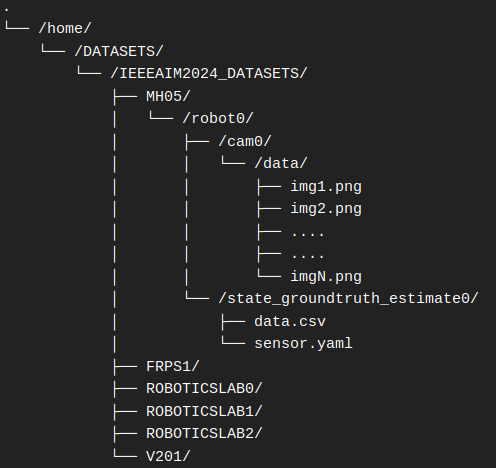

## ros2_psd_pcb_reloc

## Authors

1. Azmyin Md. Kamal
2. Neyni K. N. Dadson
3. Donovan Gegg
4. Dr. Corina Barbalata

All authors are with the Department of Mechanical Engineering at Louisiana State University, Baton Rouge, Louisiana, United States of America.

For brevity, we have divided this README into the following sections,

- Introduction
- Overview / Key Results / Bibliography
- Setup
- Run the framework

---

## Introduction

This repository is a complete ***ROS 2 workspace*** which includes the proposed short-term relocalization framework along with the presentation slides and the paper. Following ORB-SLAM3 and YOLOv5, this framework also uses [GPLv3](https://gist.github.com/kn9ts/cbe95340d29fc1aaeaa5dd5c059d2e60) License.

This work was presented in [2024 IEEE/ASME International Conference on Advanced Intelligent Mechatronics](https://www.aim2024.org/).

* [Preprint paper](TODO) 

* [Slides](https://docs.google.com/presentation/d/1p_Ukic0ZfXyZjq8wjxNMZpKOc4GEQOv2/edit?usp=sharing&ouid=110812301970152705380&rtpof=true&sd=true) 

* A side-by-side comparison between the proposed and DBoW2 based short-term relocalization frameworks is shown below

https://github.com/user-attachments/assets/8972fc59-4c30-444c-813f-4f9af7ffd1bd

Thank you for your interest in our work. If you find this project useful, please consider citing the following paper

```
TODO bibtex
```
---

## Overview / Key Results / Bibliography

In this framework, we introduced a novel multimodal keyframe descriptor dubbed **Pose-Semantic-Descriptor (PSD)**  and a new Keyframe-based Place Recognition (KPR) method called the **Pose-Class-Box (PCB)** . Using the novel KPR method, we deomstrate an accurate and computationally efficient solution to the **short-term relocalization** problem, outperforming to the popular relocalization framework based on [DBoW2](https://github.com/dorian3d/DBoW2) which comes standard in the [ORB-SLAM3](https://github.com/UZ-SLAMLab/ORB_SLAM3) framework. At this time, the proposed framework has been only tested with the **PINHOLE** camera model.

The contributions of this work are listed below

- A ***new keyframe descriptor*** called the Pose Semantic Descriptor (PSD) is proposed. It utilizes semantic data and camera pose to uniquely characterize keyframe objects in the pose graph. 

- A novel ***Keyframe Place Recognition (KPR)*** algorithm called the Pose-Class-Box (PCB) is formulated that significantly improves pose recovery performance from sudden tracking loss events

- The integration of the proposed descriptor and KPR method for iwithin the open-source ORB-SLAM3 VSLAM framework.

Important results from this work are shown below

<!--  -->

The novel framework is implemented as a combination of **three** packages / modules 

* ```orb_slam3_ros2```: A MKVSLAM package based on [ROS2 ORB-SLAM3 V1.0](https://github.com/Mechazo11/ros2_orb_slam3) VSLAM system.

* ```py_ob_detector_yolov5``` A custom ROS 2 package that implements [YOLOv5 V5.0](https://github.com/ultralytics/yolov5), a PyTorch-based Object Detector. This package may be used in a **stand-alone** configuration with minor modifications. Please see the ```README.md``` file in  package for more details

* ```matimg_custom_msg_interface```, a package containing all custom messages required to transfer the semantic matrix between the MKVSLAM and Object Detector nodes.

* All experiments were done in a laptop with the following configurations
    * Ubuntu 22.04 Jammy Jellyfish
    * Intel i5-9300H
    * Nvidia RTX 2060
    * 16 GB ram

* In this implementation, the **python nodes** are the primary driver of the system as it ingests image frames from chosen directory and then supplies the **Semantic Matrix** to the C++ VSLAM nodes.

**Note!**, ORB-SLAM3 is a very [memory-intensive application](https://github.com/Mechazo11/ros2_orb_slam3/issues/7). It is highly recommended to have at least 16Gb RAM with 8Gb swap during compilation.

---

## Setup

### Prerequisits

Please install and test the following software before building the workspace in this directory.

- ROS 2 Humble Hawksbill:  [tutorial](https://docs.ros.org/en/humble/index.html)

- Colcon: ```sudo apt install python3-colcon-common-extensions```

- Eigen3: ```sudo apt install libeigen3-dev```

- Numpy: ```pip3 install numpy```

- PyTorch with CUDA: [installation](https://docs.vultr.com/how-to-install-pytorch-on-ubuntu-22-04) and [test](https://stackoverflow.com/questions/48152674/how-do-i-check-if-pytorch-is-using-the-gpu)

- Natsort : ```pip3 install natsort```

- Requests: ```pip3 install requests```

### Configure .bashrc

I have used ```ros2_config.sh```, a shell script that automatically loads all the necessary configurations and sources both ros global and local workspaces everytime a new terminal is opened.

- Copy ```ros2_config.sh``` from ```\shell_script``` folder into ```\home```

- Add the following lines at the very end of the file of ```.bashrc```

```text
source ~/ros2_config.sh

if [[ ":$LD_LIBRARY_PATH:" != *":/usr/local/lib:"* ]]; then
    export LD_LIBRARY_PATH=/usr/local/lib:$LD_LIBRARY_PATH
fi
```

### Build workspace

This workspace must be placed in ```\home``` directory as shown below

- Open a new terminal and execute the following commands

```console
cd ~
git clone https://github.com/RKinDLab/ros2_psd_pcb_reloc
cd ros2_psd_pcb_reloc
colcon build --symlink-install
source ./install/setup.bash
```

#### Setup DATASETS/IEEEAIM2024_DATASETS

For demonstrating how to use this framework, we have packed all image sequencse from our in-house UGV dataset ```LSU_ICORE_MONO```, the ```MH05```, ```V201``` datasets from [EuRoC MAV](https://projects.asl.ethz.ch/datasets/doku.php?id=kmavvisualinertialdatasets) and the ```FR2PS1```, which is a **ETH ASL** compliant version of the ```fr2/pioneer_slam``` dataset from [TUM RGBD SLAM](https://cvg.cit.tum.de/data/datasets/rgbd-dataset/download) dataset and all the weights in this [LSU_AIM2024 repository]() Zenodo repository. After downloading the files, do the following

- Create the ```DATASETS\``` directories in ```\home``` directory as shown below

```console
cd ~
mkdir DATASETS
```

- Copy the ```IEEEAIM2024_DATASETS``` directory from ```LSU_AIM2024``` into ```home\DATASETS\``` so that the directory looks like the following 

---

#### Download the weights for YOLOv5

- Copy the ```.pt``` files from ```LSU_AIM2024\Weights``` into ```src\py_obj_detector_yolov5_ros2\weights_config``` directory

---

#### Run the framework

Once the ```DATASET``` directories with data for individual experiment scenarios have been setup and the YOLOv5 network has been setup, open three terminal windows and in all three, change directory into ```ros2_psd_pcb``` using ```cd ~/ros2_psd_pcb/```. 

**NOTE!**, the C++ nodes must be started **first** before launching the python node since a ```handshake``` is performed between the C++ and Python node to pass all experiment and configuration parameters.

- Run ***robot0*** slam node:  ```ros2 run orb_slam3_ros2 vslam_node --ros-args -p agent_name:=robot0```

- Run ***robot1*** slam node:  ```ros2 run orb_slam3_ros2 vslam_node --ros-args -p agent_name:=robot1```

- Run python nodes : ```ros2 run py_obj_detector_yolov5_ros2 robot_combined_nn --ros-args -p experiment:="ieeeaim2024" -p image_sequence:="MH05"```

---

### Evaluate results

TODO

--

### Acknowledgement

The authors would like to acknowledge financial support from NSF #2024795, and the Louisiana Board Of Regents Support Fund, under the Louisiana Materials Design Alliance (LAMDA), provided by the Board as cost share to the NSF under grant number OIA-#1946231.

---

## TODOs

- [ ] Start Zenodo and only publish LSU_iCORE_MONO dataset with instructions on how to download and setup the EuRoC and TUM FR2 dataset [1st week July 2024]

- [ ] Upload all weights to Zendo and then download and test to make sure they work

- [ ] For making a custom dataset work with the YOLOv5 in py_obj_detector, custom yaml files are needed. State how to add them into the /global_yaml files . This information needs to be placed ion the ```ros2_psd_pcb``` repository

- [ ] Double check to make sure the VSLAM nodes are loading their camera configuration settings

## DONE

- [x] Build and test the packages [05/20/24]
- [x] Better introduction line shown in the top-left [07/02/24]
- [x] Update README.md file with clear step by step instruciton on setting up the system
- [x] Delete all package 2 related codes, ros2_tictoc_profiler, line_lbd, fast_mf

## Misc.

* [DUAL-SLAM](https://github.com/HuajianUP/Dual_SLAM) A purely spatial data based relocalization method, published in IROS 2020. They also solved the same problem as this paper

* [ROS2 Humble](https://docs.ros.org/en/humble/Installation/Ubuntu-Install-Debians.html)

* [ROS2 workspace](https://www.google.com/url?sa=t&source=web&rct=j&opi=89978449&url=https://www.youtube.com/watch%3Fv%3D3GbrKQ7G2P0&ved=2ahUKEwi4gLGAyZyGAxUt38kDHfQBDkAQwqsBegQIExAG&usg=AOvVaw3DbkiwvqPzk4Im6OomO3jM). 

* [Tutorial on multiple ROS 2 workspaces](https://www.google.com/url?sa=t&source=web&rct=j&opi=89978449&url=https://www.youtube.com/watch%3Fv%3DEk2nnWM5zp8&ved=2ahUKEwi4gLGAyZyGAxUt38kDHfQBDkAQwqsBegQIFBAG&usg=AOvVaw1KlhKy-YPUIyzQWg2C4Buc)

* [GDB with ros2](https://juraph.com/miscellaneous/ros2_and_gdb/)

* [shell scripting](https://www.shellscript.sh/variables1.html)
